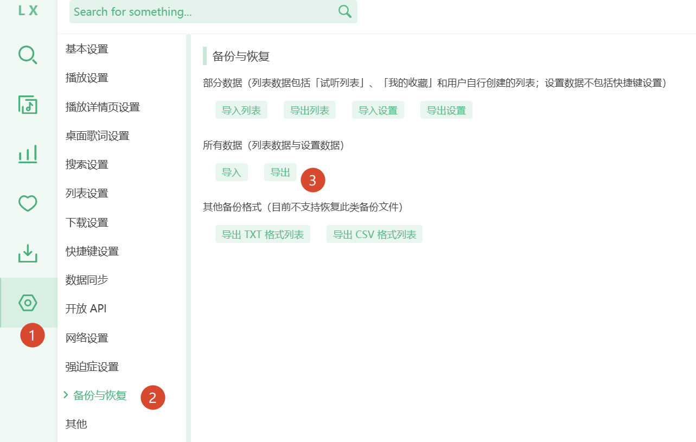
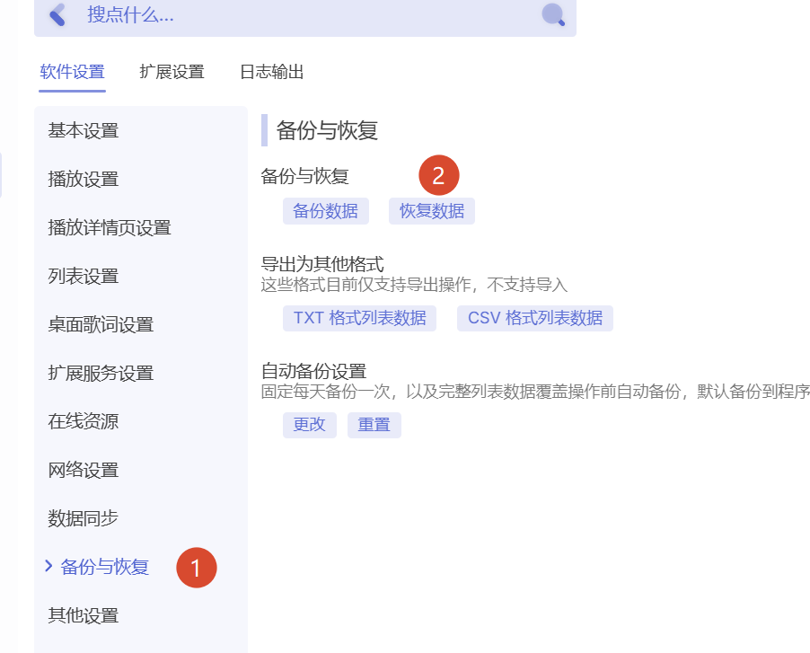

# lxmc2alcfg

把 **lx-music** 备份（`.lxmc` / `.json`）转换成 **any-listen** 歌单备份（`.alcfg`）。

零第三方依赖（仅 Python 标准库）。同时支持 gzip 压缩的 `.lxmc` 与纯 JSON。

## 用途

[lx-music-desktop](https://github.com/lyswhut/lx-music-desktop) 与 [any-listen](https://github.com/any-listen/any-listen) 都能管理本地歌单，但备份格式不同。本工具把 lx-music 的歌单迁移到 any-listen，无需手动重录。

## 快速上手（Windows exe）

### 1. 从 lx-music 导出歌单

打开 **lx-music → 设置（齿轮）→ 备份与恢复**，任选其一导出：

- **导出列表**：只导出歌单（试听列表 / 我的收藏 / 用户列表），得到 `lx_list.lxmc`
- **导出**（所有数据）：导出歌单 + 设置，得到 `lx_datas_v2.lxmc`





### 2. 用 exe 转换

到 [Releases](https://github.com/cute-aaa/lx2al/releases) 下载 `lx2al-windows-amd64.exe`，无需安装 Python：

```bat
:: 完整备份转换
lx2al-windows-amd64.exe G:\Download\lx_datas_v2.lxmc -o G:\Download\any-listen.converted.alcfg

:: 仅歌单备份同样支持
lx2al-windows-amd64.exe G:\Download\lx_list.lxmc -o G:\Download\any-listen.converted.alcfg

:: 先看统计、不写文件
lx2al-windows-amd64.exe G:\Download\lx_datas_v2.lxmc --dry-run

:: 输出明文 JSON（便于检查）
lx2al-windows-amd64.exe G:\Download\lx_datas_v2.lxmc --json --pretty -o out.json
```

把 exe 放到任意目录即可运行；路径含空格时请加引号：

```bat
lx2al-windows-amd64.exe "D:\我的备份\lx_datas_v2.lxmc" -o "D:\我的备份\any-listen.alcfg"
```

### 3. 导入 any-listen

打开 **any-listen → 设置 → 备份与恢复 → 恢复数据**，选择生成的 `.alcfg`。

## 安装（源码）

```bash
python -m pip install -e .

# 或免安装直接运行
python -m lxmc2alcfg --help
```

需要 Python 3.10+。等价命令行：

```bash
python -m lxmc2alcfg G:/Download/lx_datas_v2.lxmc -o G:/Download/any-listen.converted.alcfg
python -m lxmc2alcfg lx_datas_v2.lxmc --dry-run
python -m lxmc2alcfg lx_datas_v2.lxmc --json --pretty -o out.json
```

### 自行打包 exe

```powershell
powershell -File build_exe.ps1
# 输出: dist/lx2al.exe
```

## 支持的 lx-music 输入

| `type` | 含义 |
|---|---|
| `allData_v2` | 完整备份（设置 + 歌单），默认导出 `lx_datas_v2.lxmc` |
| `allData` | 旧版完整备份（≤ 0.6.2） |
| `playList_v2` | 仅歌单（`lx_list.lxmc`） |
| `playList` | 旧版仅歌单 |
| `playListPart_v2` | 单列表片段 |

支持 gzip（`.lxmc`）或 UTF-8 JSON。

## 字段映射

| lx-music | any-listen |
|---|---|
| `playList[].list[]` | `songlist.data.*.list[]` |
| `id: default` / `list__name_default` | `defaultList` |
| `id: love` / `list__name_love` | `loveList` |
| 其他列表 | `userList[]`（`type: "general"`） |
| 歌曲 `meta.songId` | 歌曲 `id` + `meta.musicId` |
| 歌曲 `source` | `meta.source` |
| `meta.qualitys[]` / `meta._qualitys` | `meta.qualitys`（`{type: {sizeStr, hash?}}`） |
| `interval` `"mm:ss"` | `meta._interval`（秒） |
| 列表 `source` / `sourceListId` | 写入列表 `meta.desc`：`lx:<source>:<sourceListId>` |
| 来源扩展字段（`hash`、`albumId`、`copyrightId` 等） | 保留在 `meta` 上 |

## 说明与限制

- **设置（setting）不会转换**，两边配置体系不同，请在 any-listen 内重新设置。
- lx 在线列表链接（`source` + `sourceListId`）记入 `meta.desc`，歌曲本体会物化为普通 `general` 列表；不会生成 any-listen 的 `online` / `local` / `remote` 列表类型。
- `临时列表` 会变成名为 `temp` 的用户列表。
- 歌曲 id 取 lx `meta.songId`（不含 kg 的 hash 后缀）。同一首歌出现在多个列表是正常现象，会分别保留。

## 开发

```bash
python -m unittest discover -s tests -v
```

格式来源：

- any-listen 类型：[`list.d.ts`](https://github.com/any-listen/any-listen/blob/main/packages/shared/types/types/list.d.ts)、[`music.d.ts`](https://github.com/any-listen/any-listen/blob/main/packages/shared/types/types/music.d.ts)
- lx-music 类型：[`list.d.ts`](https://github.com/lyswhut/lx-music-desktop/blob/master/src/common/types/list.d.ts)、[`music.d.ts`](https://github.com/lyswhut/lx-music-desktop/blob/master/src/common/types/music.d.ts)

## 许可

MIT
